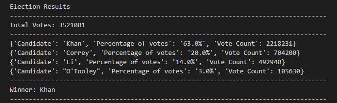

# Python-Challenge

In this challenge I was given two datasets to work with: PyBank, and PyPoll. Both of these dataset come as a csv and represents two different dataset. Pybank is the financial records of a company, where PyPoll is the election results of a city. 

### Tools
The data source can be found in the Resources folder for each of the dataset. The tools I will be using to analyze the data is Python. I will import os and csv so that I can open and use the csvfiles. 

### Data

#### PyBank
When I opened PyBank the information presented to me was a Date column and a Profit/Losses column. Using this data I found the Total Months for the dataset, the total amount of money the company has, the average monthly change, and what the greatest increase and decrease in profit was. While working with the code I realized that I had to change my data into integers, otherwise I wasn’t going to be able to do my calculations, so after there I used for loops to help me find my results. At the end of my script I also have it set to print and export my findings into a txt file that will save into the Resources folder.  Below is a screenshot of the txt file results. 

----

----
----
#### PyPoll
Working with PyPoll was as similar process as PyBank. What I found to be different and what worked best for me was that I had to create a nested dictionary. This allowed me to see the candidate and what their results where. After this I had to single out each candidate by their percentage of votes to find who was the winner of the election, I also used an if statement for this part of the analysis. Like PyBank I also exported my findings as a txt file in the Resources folder. 

----

